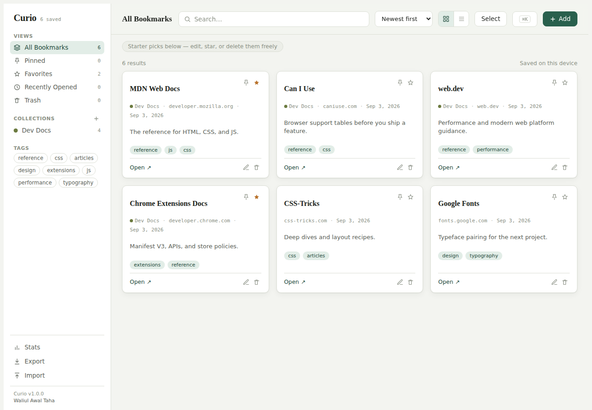

# Curio

  

A fast, self-hosted bookmark library. Save links into collections, tag them, star favorites, pin what matters, search everything, and get a small stats view of your own habits — no account, no tracking, no server-side database required.

Curio is a single self-contained HTML file: no build step, no framework, no backend. It runs anywhere a static file can be served, including as a Docker container.



## Features

- **Collections** — organize bookmarks into named, color-coded folders
- **Tags, search, and sort** — filter by tag, free-text search, sort by newest/oldest/title/most-opened
- **Pinned, Favorites, Recently Opened, and Trash** — smart views alongside your collections, with a 30-day undo window before anything is deleted for good
- **Bulk actions** — multi-select to tag, move, favorite, or trash several bookmarks at once
- **Duplicate detection** — warns you before you save a link twice
- **Import / export** — round-trip a JSON export, or import/export a standard Netscape bookmarks HTML file (the format Chrome, Firefox, and Safari all use)
- **Command palette** — `Cmd/Ctrl+K` to jump anywhere or search bookmarks without touching the mouse
- **Keyboard shortcuts** — `/` search, `n` new bookmark, `f`/`p`/`r`/`t`/`a` to jump views, `Esc` to close
- **Grid or list layout**, light/dark theme (follows your system setting)

## Quick start (Docker)

```bash
docker compose up -d
```

Then open **http://localhost:8080**.

Or without Compose:

```bash
docker build -t curio .
docker run -d --name curio -p 8080:80 curio
```

## Quick start (no Docker)

Curio is one HTML file — serve it with anything that can serve static files:

```bash
python3 -m http.server 8080
# or: npx serve .
```

Then open **http://localhost:8080**. You can also just open `index.html` directly in a browser.

## Where your data lives

Curio stores bookmarks in your browser's `localStorage`, scoped to whatever origin you're serving it from. That means:

- Your data stays on your device — nothing is sent to a server.
- It's per-browser: if you self-host Curio on two devices, they won't automatically sync. Use **Export** (in the sidebar) to move your data between them, or **Import** to bring in a browser bookmarks export.
- Clearing your browser's site data for that origin clears your bookmarks. Export regularly if that matters to you.

(If you're viewing Curio through Claude's artifact platform rather than self-hosting it, it instead syncs live through Claude's built-in storage — same app, different storage backend, chosen automatically.)

## Tech

Vanilla HTML/CSS/JS, no dependencies, no build tooling. Fonts load from Google Fonts (IBM Plex Serif/Sans/Mono) with system-font fallbacks, so it still works fine offline. Served in production by `nginx:alpine`.

## Versioning

Current version: **1.0.0** — shown in the sidebar footer.

## License

MIT — see [LICENSE](LICENSE).

## Publishing this repo to GitHub

This folder is ready to become a repo — it just isn't one yet. From inside it:

```bash
git init
git add .
git commit -m "Initial commit: Curio 1.0.0"
git branch -M main
git remote add origin https://github.com/<your-username>/curio.git
git push -u origin main
```

Update the `repository` field in `package.json` to match once you've created the GitHub repo, if the name ends up different from `curio`.

## Credit

Built by [Waliul Awal Taha](https://waliulawaltaha.com).
